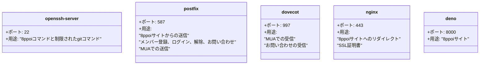

```mermaid
classDiagram
    class openssh-server {
        +ポート: 22
        +用途: "8ppoiコマンドと制限されたgitコマンド"
    }

    class postfix {
        +ポート: 587
        +用途: 
            "8ppoiサイトからの送信"
            "メンバー登録、ログイン、解除、お問い合わせ"
            "MUAでの送信"
    }

    class dovecot {
        +ポート: 997
        +用途: 
            "MUAでの受信"
            "お問い合わせの受信"
    }

    class nginx {
        +ポート: 443
        +用途: 
            "8ppoiサイトへのリダイレクト"
            "SSL証明書"
    }

    class deno {
        +ポート: 8000
        +用途: "8ppoiサイト"
    }
```