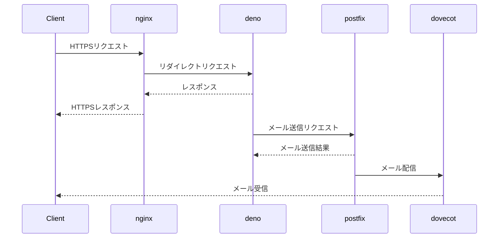

```mermaid
sequenceDiagram
    participant Client
    participant nginx
    participant deno
    participant postfix
    participant dovecot

    Client->>nginx: HTTPSリクエスト
    nginx->>deno: リダイレクトリクエスト
    deno-->>nginx: レスポンス
    nginx-->>Client: HTTPSレスポンス

    deno->>postfix: メール送信リクエスト
    postfix-->>deno: メール送信結果

    postfix->>dovecot: メール配信
    dovecot-->>Client: メール受信
```